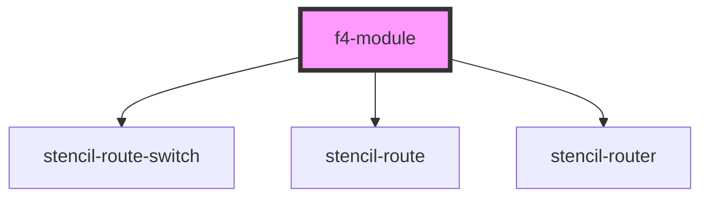

# f4-module

<!-- Auto Generated Below -->

## Properties

| Property   | Attribute  | Description | Type     | Default |
| ---------- | ---------- | ----------- | -------- | ------- |
| `endpoint` | `endpoint` |             | `string` | `''`    |

## Dependencies

### Depends on

-   stencil-route-switch
-   stencil-route
-   stencil-router

### Graph

---

_Built with [StencilJS](https://stenciljs.com/)_
