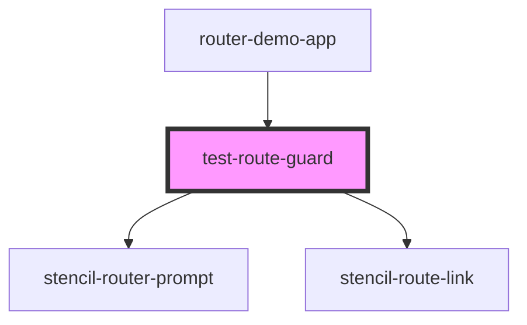

# test-route-guard

<!-- Auto Generated Below -->

## Properties

| Property  | Attribute | Description | Type            | Default     |
| --------- | --------- | ----------- | --------------- | ----------- |
| `history` | --        |             | `RouterHistory` | `undefined` |
| `match`   | --        |             | `MatchResults`  | `null`      |
| `pages`   | --        |             | `string[]`      | `undefined` |

## Dependencies

### Used by

-   [router-demo-app](.)

### Depends on

-   stencil-router-prompt
-   stencil-route-link

### Graph

---

_Built with [StencilJS](https://stenciljs.com/)_
